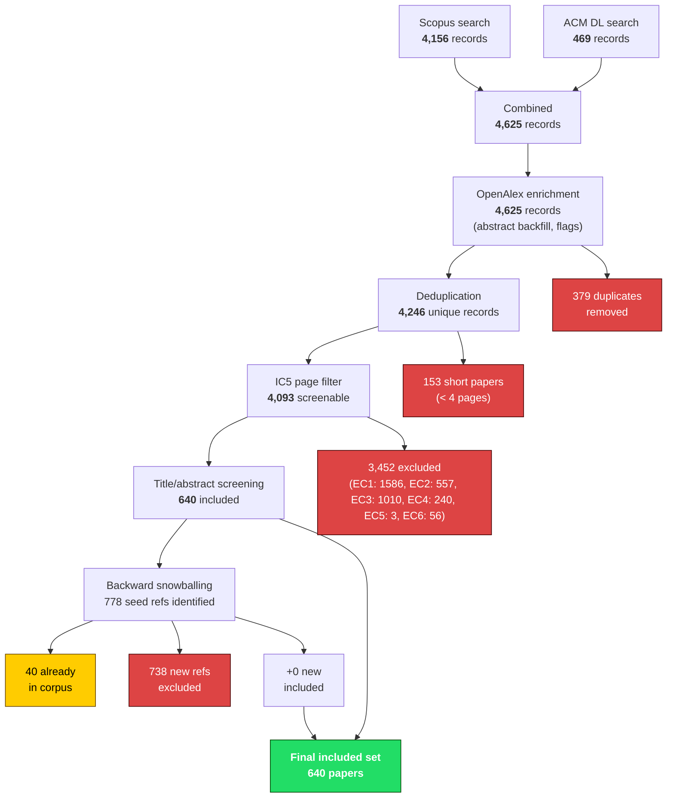

# PRISMA Flow Diagram — ERP2-SMS

> **How Do People Use AI Agents for Software Engineering?**
>
> Generated by `code/prisma_builder.py` on 2026-04-16 02:49 UTC.
> Every stage's `in − excluded = out` has been verified programmatically.

---

## Count Table

| Stage | Description | In | Removed | Out |
|------:|-------------|---:|--------:|----:|
| 1 | Database search (Scopus + ACM DL) | — | — | 4,625 |
| 1a | Scopus | — | — | 4,156 |
| 1b | ACM DL | — | — | 469 |
| 2 | OpenAlex enrichment | 4,625 | 0 | 4,625 |
| 3 | Deduplication | 4,625 | 379 | 4,246 |
| 4 | IC5 page filter (< 4 pages) | 4,246 | 153 | 4,093 |
| 5 | Title/abstract screening | 4,093 | 3,452 | 640 |
| 5d | Deferred (unresolved) | — | — | 1 |
| 6 | Backward snowballing | 778 refs | 738 new excluded | +0 new |
| 6a | Already in corpus | — | — | 40 |
| 7 | **Final included set** | — | — | **640** |

### Exclusion breakdown (Stage 5)

| Criterion | Count | % of exclusions |
|-----------|------:|-----------:|
| EC1 | 1,586 | 45.9% |
| EC2 | 557 | 16.1% |
| EC3 | 1,010 | 29.3% |
| EC4 | 240 | 7.0% |
| EC5 | 3 | 0.1% |
| EC6 | 56 | 1.6% |

---

## Mermaid Flowchart

---

*Reconciliation verified by `code/prisma_builder.py`. All `in − excluded = out` checks passed.*
