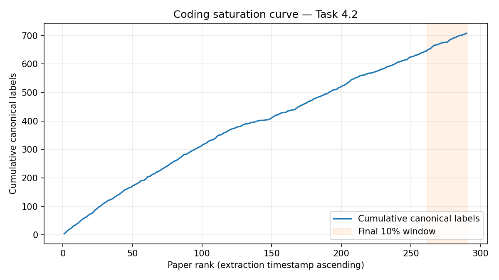

# Coding Saturation Report — Task 4.2

> Generated: `2026-04-19T03:49:17+00:00`
> Script: `code/saturation_report.py`
> Input: `artifacts/synthesis/consolidated_codes.csv` (sha1 `9853d9f07c93e1c4...`)
> Processing order source: `artifacts/extraction/extraction_status.csv` timestamp

## Summary

| Metric | Value |
|---|---:|
| Papers with ≥1 passage (denominator) | 290 |
| Total canonical labels | 708 |
| Final window fraction | 0.10 |
| Final window size | 29 papers |
| New canonical labels in final window | 63 |
| Marginal rate in final window | 2.172 labels/paper |
| **Saturation verdict** | **Not saturated — 63 new label(s) in final window** |

## Emergence curve

## Narrative

The final 10% window (29 papers) still introduced 63 new canonical label(s), a marginal rate of 2.172 labels/paper. Whether this represents a long-tail of idiosyncratic usage (acceptable) or a systematic coverage gap (which would motivate additional coding) is a qualitative call for §6.3 dependability. The singletons in `consolidated_codes.csv` are the most likely source; Task 4.2 should review whether any of the final-window novelty clusters under an existing mode at Task 4.2 (in which case saturation holds at the mode layer, the reportable dependability claim).

## Notes

- **Denominator rationale** — N counts papers with ≥1 passage (i.e. papers that actually contributed codes), not the full 640. Mode B abstract-only papers contribute no passages and are therefore excluded from the saturation denominator.
- **Processing-order rationale** — saturation in Cruzes & Dybå is about the *coding* process, not corpus composition. `extraction_status.csv.timestamp` is the nearest available proxy for when each paper was coded; lexicographic `paper_id` breaks ties.
- **Layer of analysis** — this report measures saturation at the canonical-label layer (Task 4.1 output). Saturation at the interaction-mode layer (Task 4.2 output) is stricter and is addressed once the taxonomy itself is written.
