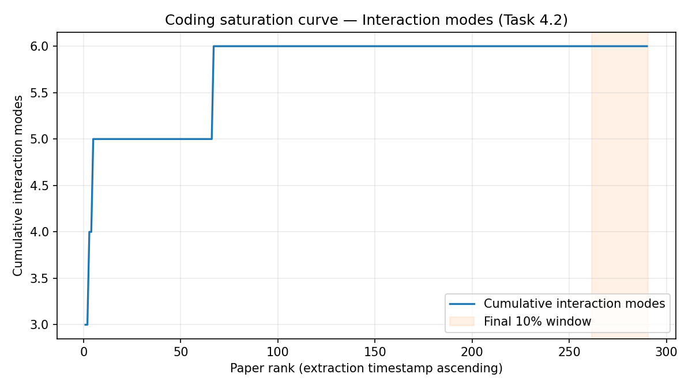

# Coding Saturation Report (interaction-mode layer) — Task 4.2

> Generated: `2026-04-19T14:35:35+00:00`
> Script: `code/saturation_report.py`
> Input: `artifacts/synthesis/consolidated_codes.csv` (sha1 `b30a44dd12bfacd5...`)
> Partition source: `artifacts/synthesis/taxonomy_classifications.csv` (707 canonical labels -> 5 modes + Residuals)
> Processing order source: `artifacts/extraction/extraction_status.csv` timestamp

## Summary

| Metric | Value |
|---|---:|
| Papers with ≥1 passage (denominator) | 290 |
| Total interaction modes | 6 |
| Final window fraction | 0.10 |
| Final window size | 29 papers |
| New interaction modes in final window | 0 |
| Marginal rate in final window | 0.000 interaction modes/paper |
| **Saturation verdict** | **Saturated** |

## Emergence curve

## Narrative

At the **interaction-mode layer** — the reportable dependability claim for Cruzes & Dybå Step 5 — new-mode emergence collapsed to zero across the final 10% of papers in extraction order (29 of 290). The taxonomy's 6 higher-order themes are **empirically saturated** for this corpus: every paper in the tail described interactions that already fit the partition built from the upstream data. This is the stronger saturation claim that §6.3 dependability stands on.

## Notes

- **Denominator rationale** — N counts papers with ≥1 passage (i.e. papers that actually contributed codes), not the full 640. Mode B abstract-only papers contribute no passages and are therefore excluded from the saturation denominator.
- **Processing-order rationale** — saturation in Cruzes & Dybå is about the *coding* process, not corpus composition. `extraction_status.csv.timestamp` is the nearest available proxy for when each paper was coded; lexicographic `paper_id` breaks ties.
- **Layer of analysis** — this report measures saturation at the **interaction-mode layer** (Task 4.2 output, 5 modes + Residuals). The canonical-label layer companion report is at `saturation_report.md`. The mode layer is the reportable dependability claim; the canonical layer is an intermediate artefact.
